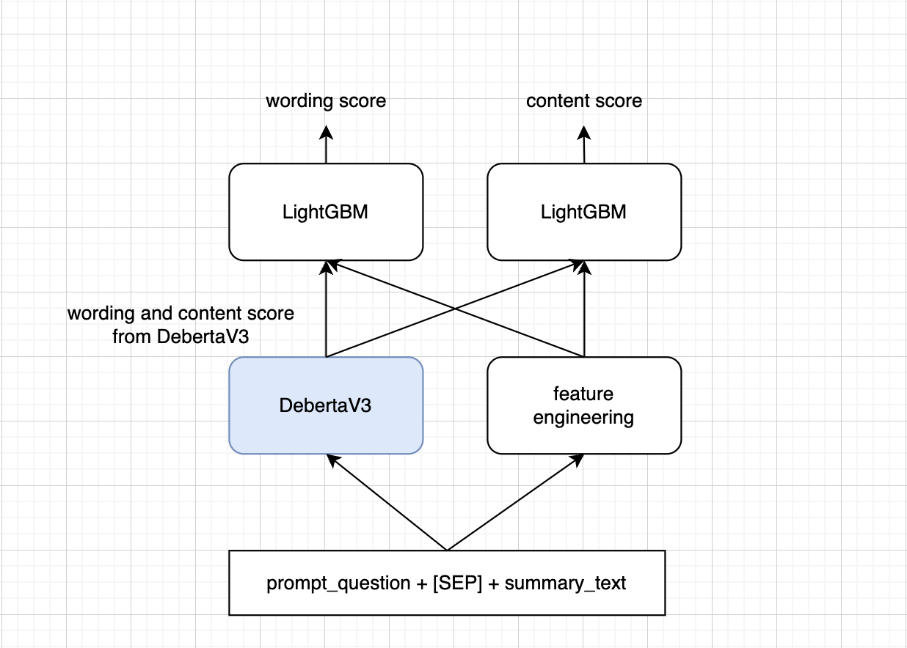

# kaggle-CommonLit-EES (60th place)
### CommonLit - Evaluate Student Summaries 
The goal of this competition is to assess the quality of summaries written by students in grades 3-12.  The quality scores consists of 2 types of score (content score and wording score).  
You can find more info about the competition and dataset on this link.  
[Kaggle link](https://www.kaggle.com/competitions/commonlit-evaluate-student-summaries/overview)

### Evaluation
Submissions are scored using **MCRMSE**, mean columnwise root mean squared error.

### Solution

This competition is tricky since the prompt question in train set and test set are different. To validate the model's performance, <code>GroupKFold</code> strategy can represent the private score more accurately. The final approach is the stacking between <code>DebertaV3</code> and <code>LightGBM</code> with additional features from text.  

### Result

|Model| Tricks| Validation strategy| CV-score | Public-score |Private-score|
|:---:|:---:|:---:|:---:|:---:|:---:|
|DeBERTa-v3-large | freeze(top_half + embeddings)   |StratifiedKFold   |0.468|0.518 |0.544|
|DeBERTa-v3-large +  LightGBM  | freeze(top_half + embeddings)| GroupKFold| 0.510|0.454|0.508|
|DeBERTa-v3-large +  LightGBM  | freeze(top_half + embeddings),  Hyperparamter tuning    |GroupKFold|0.522|0.439 |0.486|
|DeBERTa-v3-large +  LightGBM  | freeze(top_half + embeddings),  Hyperparamter tuning,  LLRD      |GroupKFold|0.492|0.439|0.471|
|DeBERTa-v3-large +  Catboost  | freeze(top_half + embeddings),  Hyperparamter tuning,  LLRD  |GroupKFold|0.499|0.439 |0.484|

LLRD        =   Layer-wise Learning Rate Decay 

### Diagram

